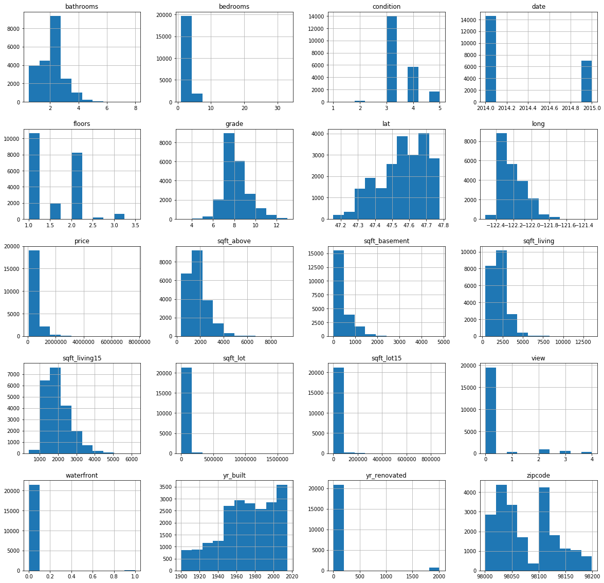
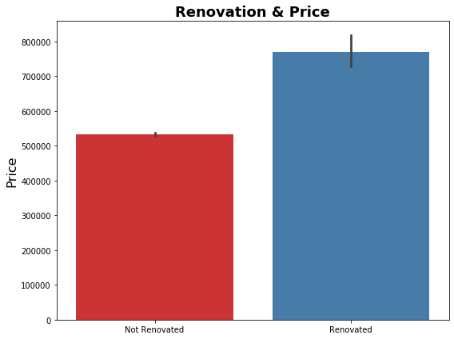
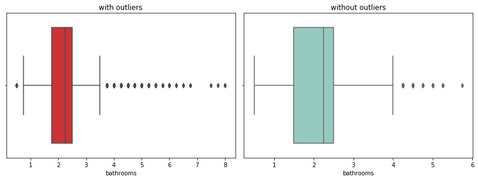
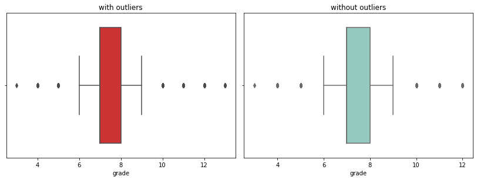
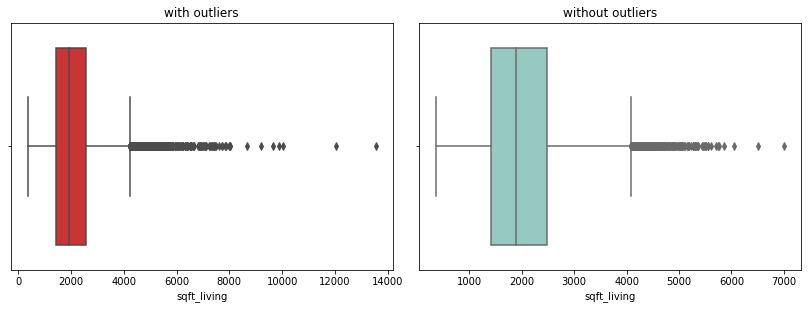
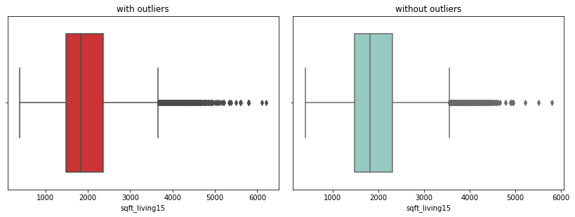
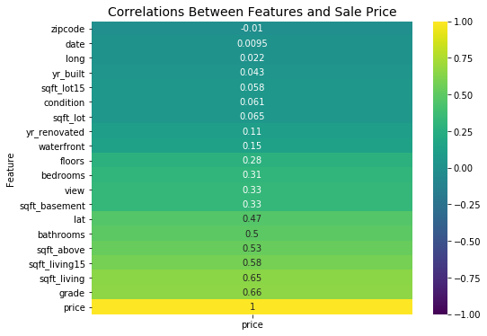
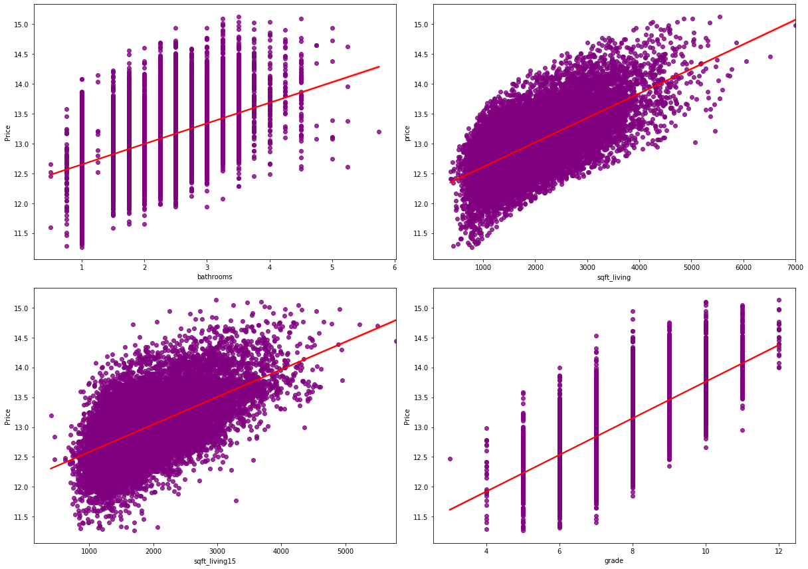
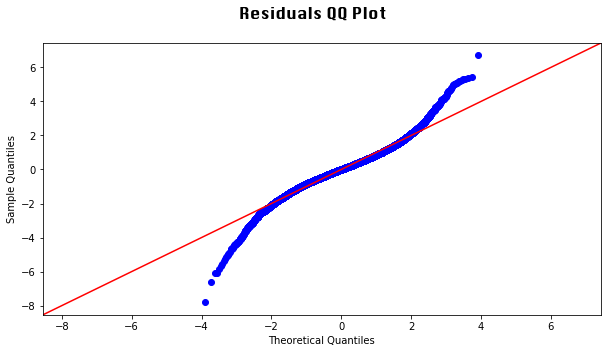
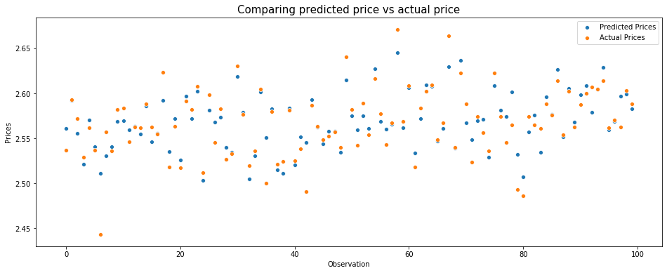

# Kings County House Market Analysis and Predictive Model Report

by Nadir Sarigul

## I. Overview and Goals

This report contains a detailed explanation of the extraction, cleaning, analysis and generation of prediction models for the house market of Kings County, Washington State (Seattle area). This report is based off of data collected from the official public records of home sales in the Kings County between 2014-2015 provided by Flatiron.  

The goal of this analysis is to evaluate what features of a house have a higher impact in the sales price of said house in Kings County and to build a model that accuratly predicts the sales price. The ultimate goal of this analysis is to inform home owners of which features should they focus on improving in preparation for selling their home to increase their profit. To answer this question, I focused mostly on features that can be changed (e.g. number of bathrooms, square footage of the house, etc) rather then features that cannot be changed (e.g. if a house has a view or is located in the waterfront, location, etc). 

To be able to understand the housing market of Kings County better, I divided this analysis in four questions:

1) Does renovation affect the price of a home?

2) What features of a home affect price the most?

3) Does location affect the price of a home significantly?

4) Is it possible to create a model that accuratly predicts the sales price of a home?

## II. Data Understanding

The data set from Kings County housing market includes information from 21597 houses on the following features:

* id - Unique identified for a house
* date - Date the house was sold
* price - Sales price of a house (is the prediction target)
* bedrooms - Number of Bedrooms
* bathrooms - Number of bathrooms/bedrooms
* sqft_living - Square footage of the home
* sqft_lot - Square footage of the lot
* floors - Total number of floors in the house
* waterfront - If the house is located in the waterfront
* view - If the house has a view 
* condition - How good the condition of the house is overall
* grade - Grade given to the housing unit, based on King County grading system
* sqft_above - Square footage of house apart without the basement
* sqft_basement - Square footage of the basement
* yr_built - Year when the house was built
* yr_renovated - Year when the house was renovated
* zipcode - zipcode at which the house is located 
* lat - Latitude coordinate at which the house is located
* long - Longitude coordinate at which the house is located 
* sqft_living15 - The square footage of interior housing living space for the nearest 15 neighbors
* sqft_lot15 - The square footage of the land lots of the nearest 15 neighbors

Here you can see an overview of the data by feature (number of houses in the Y axis):

Using this dataset we observe that the average sales price of a house in Kings County from 2014-2015 is 540 thousand dollars, while the minimum sales price is 78 thousand dollars and the maximum sales price is 7.7 million dollars.  

## III. Data Preparation for Exploration

### 1) Data imported

* kc_house_data.csv

### 2) Cleaning and preparation of dataset 

* After looking at the general properties of the data (shown above), I decided to drop the ID feature from the dataset as it does not provide any relevant information for this analysis. All the remaining features were maintained in the final dataset used for analysis. The duplicates present in the dataset (4) were also removed. 

* Missing values were detected in the features "waterfront" (2376 missing values), "view" (63 missing values) and "yr_renovated" (3842 missing values). In the case of the waterfront and view features I simply replaced all the missing values with "0", which indicates the absence of waterfront and/or view. In the case of year renovated, it is likely that values missing in this feature are a reflection of no renovation being done, therefore I replaced the missing values with 0. 

* The feature containing the information of the square footage of the basement ("sqft_basement") also had many unknown values. In this case I proceeded differently than the cases outlined above because the information of the total square footage of the house ("sqft_living") and the square footage of the living space above the garage ("sqft_above") were available. I estimated the square footage of the basement by subtracting sqft_above from the sqft_living and replaced the unknown values with this estimation for each house entry that did not contain the information of the square footage of the basement. 

* The final dataset used in the subsquent analysis caintained 21593 houses. 

## IV. Data Exploration

### 1) Does renovation affect the price of a home?

When comparing the sales price of houses that have been renovated (769 thousand dollars on average) and houses that have not been renovated (532 thousand dollars on average), it is clear that renovation substantially increases the average sale price of a home. Renovating a house in Kings County yields an increase in sales price of about 144%. 

### 2) What features of a home affect price the most?

To determine which features of a house affect their sales price, I performed a correlation analysis. This analysis shows that only a few features correlate with price with a correlation coeficient higher than 0.5 (which is the treshold established for a positive correlation): number of bathrooms, the square footage of the entire living space as well as of the living space except for the basement, grade and the square footage of the living space in the neighborhoods surrounding the house.  

### 3) Does location affect the price of a home significantly?

To my surprise, the correlation analysis showed that none of the location-related features (zipcode, latitute and longitude) correlated with price. A closer analysis of the distribution of home sales price by zipode confirmed what was observed in the correlation analysis as no direct relationship is observed in general between zipcode and price. However, it is important to note that when looking at the histogram of the distribution of sales price through all zipcodes in the dataset certain zipcodes do show a pronounced increase in price. Therefore, while my analysis shows no direct correlation between location and price, this relationship is likely more nuanced and a deeper analysis may revel specific areas that do significantly affect the sales price of a home. 

## V. Data Preparation for Modeling

From my data exploration analysis, I decided to use the independent variables (features) that correlate with the dependent variable (price). Those are the number of bathrooms, the square footage of the entire living space as well as of the living space except for the basement, grade and the square footage of the living space in the neighborhoods surrounding the house. Now to ensure that the data present in these variables is in appropriate conditions for modeling, I performed some additional analysis and transformations of the data set:

* Outliers: By looking at the general properties of the data (shown above) it was clear that there were a considerable amount of outliers in several features. After performing data exploration and deciding on which features (variables) would be of interest to use for model development I proceed with removing the outliers from the variables "bathrooms", "sqft_living", "sqft_above", "sqft_living15" and "grade". To better understand how outliers may be skewing the data for each of these variables I visualized the data using boxplots. This type of data display allows us to visualize groups of numerical data as quartiles, hence revealing if a specific variable contains significant outliers that may affect the analysis of the data. Looking at the boxplots is clear that all of these variables contain an elevated number of outliers. Therefore, I proceed with removing the outliers by removing the top 25% (Q3) and bottom 25% (Q1) of the data points in each variable. After removing these outliers, the dataset now contains data pertaining 20975 houses.

* Data Transformation: From my exploratory analysis I can see that the data for price has a skewed distribution (see above data understanding graphs). Therefore, I decided to transform the price data using the Log10 transformation method to make the patterns for this variable more interpretable and for helping meet the assumptions necessary for modeling. As observed below performing this transformation did not significantly alter how sales price correlated with the remaining variables.

In order to be able to build a model to predict the sales price of a home, I will use the multiple linear regression analysis. However, there are a few assumptions that need to be met in order to be able to generate a model using this method: no multicollinearity; linear relationship between dependent and independent variables; homoscedasticity of error terms; and normal distribution of model residuals. In preparation for generating the models I looked into some of these properties to ensure the data will meet all the necessary standards of the multiple linear regression analysis: 

* Multicollinearity: Generally speaking, when performing multiple linear regression analysis it is not advised to include independent variables that correlate with each other. However from my correlation analysis (displayed above) I can see that several of the independent variables correlate with one another (e.g. bathrooms correlate with bedrooms; sqft_living correlates with sqft_above). To ensure that there is no multicollinearity in the independent variables that I have selected from the data exploration I performed a multicolinearity analysis. This analysis shows that although the square footage of the entire living space ("sqft_living") and the living space that does not include the bathroom ("sqft_above") both highly correlate with the sales price, they also correlate with each other. Thus, to build my predicitve  model I have decided to just include the variable sqft_above.  

* Linear relationship between dependent and independent variables: Looking at the relationship between the sales price and the set of features that I decided to include in the model, it is easy to see that there is in fact a linear relationship between dependent and independent variables meeting the assumption required for the multiple linear regression analysis. 

## VI. Modeling

The null hypothesis tested by these multiple regression models is that there is no relationship between the independent variable and the dependent variable.

### Model 1

First I decided to do a model including all the independent variables that I had identified as correlating with sales price and that met the assumptions (as described above) to see if that would be sufficient to generate a good predictive model.

The r-squared value for this model is 0.489. This model also shows that the p value of each independent variable is lower than 0.05 indicating that in all cases we can reject the null hypothesis. However, because this model could only account for about 49% of the variability of the sales price around its mean, I decided to incorporate another independent variable to see if that would make for a better predictive model. 

### Model 2

In this model, I kept all the independent variables that I used on model 1 but in addition also included zipcode as a categorical independent variable. I have choosen this variable because while exploring the data, I have had the sense that even though zipcode did not correlate with price there was more to it than what meets the eye. 

Model 2 has an r-squared value of 0.814, indicating that it can account for about 80% of the variability of the sales price as opposed to 49% of model 1. The p value of the independent variables also included in model 1 are again lower than 0.05. Interestingly, when looking at the different zipcodes, I can see that while the majority of the zipcodes p values are lower than 0.05, some zipcodes (98002, 98003, 98023, 98032 and 98092) are not and therefore we have to accept the null hypothesis for these particular zipcodes. 

This model also moderatly meets the normal distribution of the residues and to some extent also meets the homoscedasticity assumption. Thus, overall it seems that is it a decent model to predict the sales price. Now it's time to test if model 2 is in fact able to accuratly predict the sales price of a house in Kings County. To test if model 2 is a good predictor, I used 75% of the data to train the model and the remaining 25% to test the model.  The mean squared error train is 1.23e-09  while the mean squared error test is 1.11e-8. The r squared train is 0.81 and the r squared test is 0.82. Both of these values are similar, which suggests that the model will perform similarly on different data. 

Looking at this analysis we can see that Model 2 is a decent predictor of the sales price of homes in Kings County, although with room for improval. It is possible that performing transformation of some of independent variables to normalize them further will improve the performance of the model. It is also possible that including some other independent variables will improve the model.  

## VII. Conclusions

From my analysis of the Kings County housing database I can conclude that:

* Doing renovations on a house leads to higher sales prices;

* The best features that predict price are the number of bathrooms, the square footage of living space, the grade attributed by Kings County to the house and how big houses in the nearby neighborhoods;

* The location of the house affects the sales price, however it is dependent on the particular zipcode. Certain zipcodes do not have any relationship with the sales price while others do;

* When thinking about renovating a house for sale the best features to focus on are increasing the number of bathrooms as well as increasing the square footage of the living space. Increasing the overall condition of the house is also important as it will result in increasing the grade attributed to the house by Kings County. 
